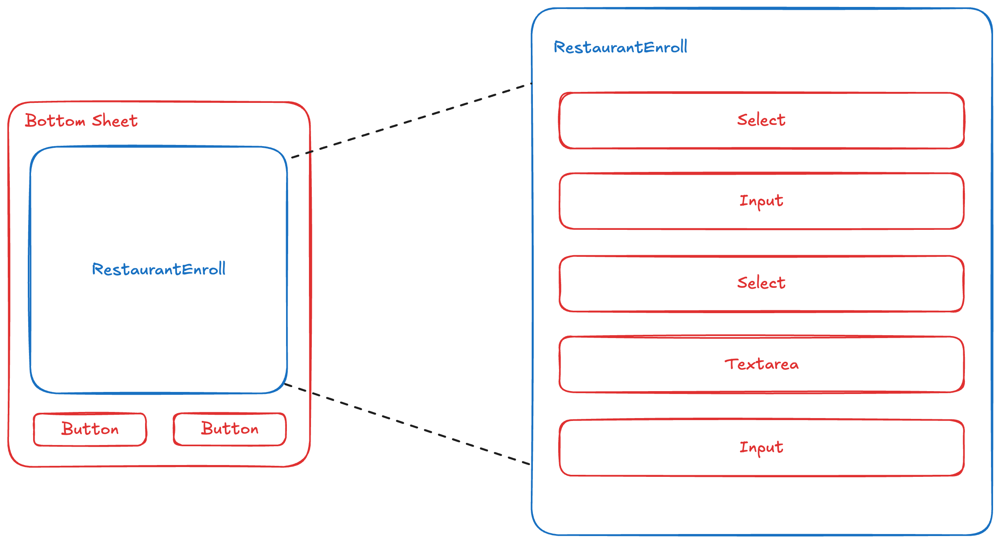

# 🍚 점심 뭐 먹지

## 학습 목표

- 어플리케이션을 컴포넌트 단위로 모듈화하여 개발
  - UI를 컴포넌트 단위로 생각하고 개발하는 연습
  - 재사용할 수 있는 컴포넌트를 고민해보기

## 요구사항 체크

캠퍼스 주변의 점심 식사 스팟 목록을 관리하는 앱을 만든다.

- [x] 음식점 목록을 확인할 수 있다.
- [x] 카테고리별로 필터링해서 확인할 수 있다.
- [x] 이름순/거리순으로 정렬해서 확인할 수 있다.

 
 

- [x] 음식점 목록에 새로운 음식점을 추가할 수 있다.
  - [x] 음식점의 카테고리, 이름, 거리(도보 이동 시간), 설명, 참고 링크를 입력해서 추가할 수 있다.
  - [x] 카테고리, 거리는 셀렉트 박스, 이름/설명/참고 링크는 텍스트 인풋을 사용한다.
  - [x] 카테고리, 이름, 거리는 입력 필수.
    - [x] 카테고리는 "한식", "중식", "일식", "아시안", "양식", "기타" 중 하나를 선택한다.
    - [x] 거리는 캠퍼스로부터 도보로 걸리는 시간(분). 5, 10, 15, 20, 30 중 하나를 선택한다.
  - [x] 설명, 참고 링크는 옵션. 입력하지 않아도 음식점을 추가할 수 있어야 한다.
  - [x] 입력값이 잘못되었을 때 사용자에게 알려주는 방식은 자유롭게 구현한다.
- [x] 새로고침해도 추가한 음식점 정보들이 유지되어야 한다.

## 컨셉

### 컴포넌트 분리 기준

### 상태 관리 처리

