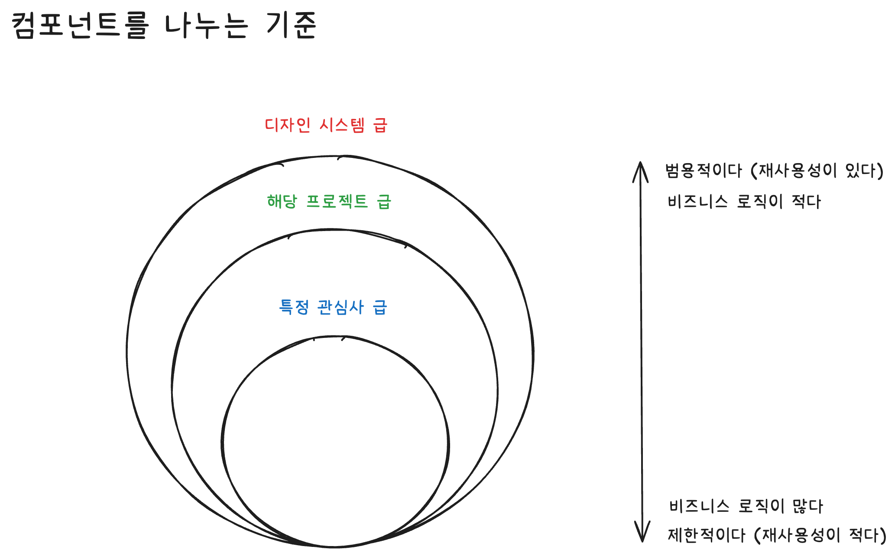
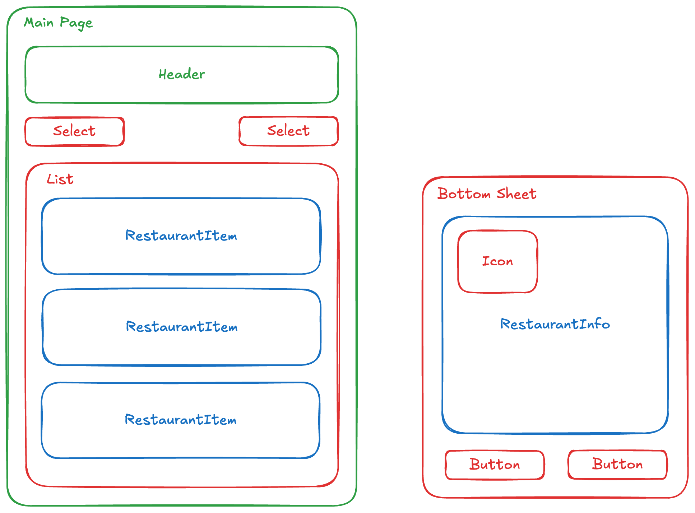
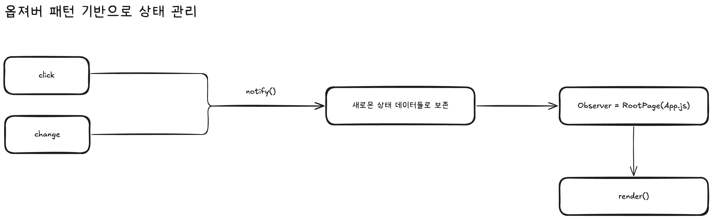

# 🍚 점심 뭐 먹지

## 학습 목표

- 어플리케이션을 컴포넌트 단위로 모듈화하여 개발
  - UI를 컴포넌트 단위로 생각하고 개발하는 연습
  - 재사용할 수 있는 컴포넌트를 고민해보기

## 요구사항 체크

캠퍼스 주변의 점심 식사 스팟 목록을 관리하는 앱을 만든다.

- [x] 음식점 목록을 확인할 수 있다.
- [x] 카테고리별로 필터링해서 확인할 수 있다.
- [x] 이름순/거리순으로 정렬해서 확인할 수 있다.

## 컨셉

### 컴포넌트 분리 기준

### 상태 관리 처리

